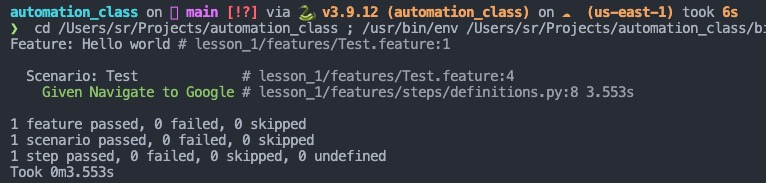

# :open_book: Automate course with Marina Leitman and Alexey Ternov (Portnov Computer School)

Here, I will upgrade my comments and progress related to homework tasks.

_UPDATED 01/17/2024 6pm_

---

Hello!
I would like to get your opinion on my format for submitting homework via GitHub.
I think it's a more convenient way to keep track of changes and progress.

## :white_check_mark: What has been done

#### The required environment is installed and configured

Thanks for the heads up on the python 3.9.x version. I was curious and compared these versions and found a huge difference. Moreover, I was surprised that some of the usual tricks don't work now or don't work properly.


I think it will be convenient to sort the work by one or several lessons. The folder tree for a lesson looks as below. Let me know if something is wrong, please.


There are additional libraries in the requirenments.txt file. This is because I used my own Python virtual environment template to work with the Web. If required, I can remove unnecessary ones or create an environment from an empty Python template.

```python
attrs==23.2.0
behave==1.2.6
certifi==2023.11.17
charset-normalizer==3.3.2
exceptiongroup==1.2.0
h11==0.14.0
idna==3.6
outcome==1.3.0.post0
packaging==23.2
parse==1.20.0
parse-type==0.6.2
PySocks==1.7.1
python-dotenv==1.0.0
requests==2.31.0
selenium==4.16.0
six==1.16.0
sniffio==1.3.0
sortedcontainers==2.4.0
trio==0.24.0
trio-websocket==0.11.1
urllib3==2.1.0
webdriver-manager==4.0.1
wsproto==1.2.0
```

Result of the first test execution:



#### See my homework on the XPath search ./lesson_1/homework.md or [click the link here](/lesson_1/homework.md)

---

### Thank you for taking the time and attention to my work.
